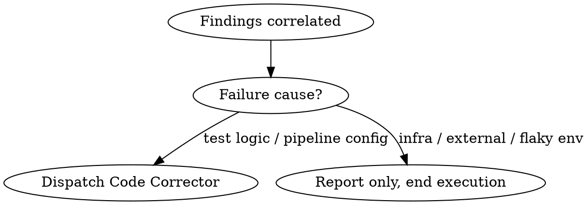

# Test Failure Analysis & Unattended Correction

## Overview

Orchestration meta-skill: dispatches parallel analysis agents against trace artifacts (and optionally CI logs), correlates findings, then proposes and implements fixes if the failure is test-side. Runs end-to-end without user interaction.

## When NOT to Use

- No trace file AND no GitHub Actions pipeline link (need at least one)
- Unit test failures (this is E2E/Playwright focused)

## Prerequisites

- **At least one of:**
  - Playwright trace archive — may be a nested zip (artifacts zip containing a `trace.zip` inside). Extract outer zip first, then locate the inner trace zip.
  - GitHub Actions pipeline link — enables CI log analysis. Sufficient on its own when tests never executed (e.g., infrastructure/setup failures).
- `gh` CLI installed and authenticated
- **Upstream targeting:** PRs and issues MUST be opened against the upstream repository (organizations `github.com/containers` or `github.com/podman-desktop`). Use `git remote -v` to identify the upstream remote. Do NOT open PRs or issues in user fork repositories.
- **`additionalDirectories`** in `.claude/settings.local.json` must include:
  - `/tmp` — artifact downloads, zip extraction, and log processing
  - `~/Downloads` — local trace archives provided by the user
  - `docs/superpowers/analysis` — analysis report output

## Tooling

- **Strict command allowlist:** only run Bash commands listed in the `allowed-tools` frontmatter and the Command Reference table below. If a command is not listed, do NOT attempt it — find an alternative using the allowed commands or dedicated tools (`Read`, `Grep`, `Glob`). A denied permission prompt will block the entire skill execution.
- **Use dedicated tools over Bash equivalents:** prefer `Grep` over `bash grep/rg`, `Read` over `bash cat/head/tail`, `Glob` over `bash find/ls`. Reserve Bash for operations that require shell features (unzip, git, gh).
- **Never chain Bash commands.** Each Bash tool call must contain exactly one command. Do not use `&&`, `||`, `;`, or `|` to combine commands. Make separate tool calls instead.
- **Package manager:** this project uses **pnpm** (not npm/npx). Always use `pnpm` to run scripts. Available scripts are defined in the root `package.json` — read it to discover the correct commands.
- **Artifact handling:** CI artifacts expire (typically 90 days). When `gh run download` returns "no valid artifacts found", fall back to `gh run view {id} --log` to read job logs directly.
- **Reading external repo files:** use `WebSearch` or `Read` on local checkouts. Do NOT use `gh api` — it is not in the allowed tools.
- **`git add` safety:** only stage files that this skill created or modified. Never use `git add .`, `git add -A`, or stage files outside `.github/workflows/`, `tests/`, and `packages/` without explicit justification in the analysis report.
- **`git push` safety:** before pushing, verify with `git remote -v` that `origin` points to the user's fork, not the upstream repository. Never push directly to upstream.
- **Artifact extraction:** always extract to `/tmp/`. Never unzip into the project working tree.
- **Repo scoping:** all `gh pr create`, `gh gist create`, and `gh issue create` commands must target the upstream repo identified via `git remote -v`. Never target arbitrary repositories.
- **NEVER `git checkout -b`, `git add`, or `git commit` when `COMMIT=false`.** These commands are gated. If `COMMIT` is not explicitly `true`, any attempt to branch, stage, or commit is a skill violation. Leave changes as unstaged working-tree modifications.
- **NEVER `git push`, `gh pr create`, `gh gist create`, or `gh issue create` when `PUBLISH=false`.** These commands are gated. If `PUBLISH` is not explicitly `true`, any attempt to push or interact with GitHub is a skill violation. No remote side effects.

### Command Reference

| Command                                                   | When to use                                               | Guard          |
| --------------------------------------------------------- | --------------------------------------------------------- | -------------- |
| `gh run view {id} --repo {owner}/{repo} --json jobs`      | Get run metadata, job details, step names and conclusions | —              |
| `gh run view {id} --repo {owner}/{repo} --log`            | Download job logs (fallback when artifacts expired)       | —              |
| `gh run list --repo {owner}/{repo} --workflow {name}`     | Check failure frequency across recent runs                | —              |
| `gh run download {id} --repo {owner}/{repo} --dir {path}` | Download test artifacts (traces, videos, results)         | —              |
| `git checkout -b`                                         | Create feature branch for committing changes              | `COMMIT=true`  |
| `git add`                                                 | Stage code/pipeline changes (never reports)               | `COMMIT=true`  |
| `git commit -m`                                           | Commit staged changes                                     | `COMMIT=true`  |
| `git push -u origin`                                      | Push branch to remote                                     | `PUBLISH=true` |
| `gh pr create --draft`                                    | Create draft PR with fix                                  | `PUBLISH=true` |
| `gh gist create --public`                                 | Create public gist with analysis report                   | `PUBLISH=true` |
| `gh issue create`                                         | Escalation: file issue when fix fails                     | `PUBLISH=true` |
| `gh label list`                                           | List available labels for issue creation                  | `PUBLISH=true` |
| `pnpm typecheck`                                          | Verify no type errors introduced                          | —              |
| `pnpm svelte:check`                                       | Verify no Svelte component errors                         | —              |
| `pnpm lint:check`                                         | Verify no lint errors introduced                          | —              |
| `pnpm format:check`                                       | Verify no formatting violations                           | —              |

**Guard column enforcement:** A command with a Guard value MUST NOT be executed unless that variable is `true`. Before running any guarded command, re-verify the variable value. If the guard is not satisfied, skip the command and log why.

## Configuration

| Variable  | Default | Description                                                                                                                       |
| --------- | ------- | --------------------------------------------------------------------------------------------------------------------------------- |
| `COMMIT`  | `false` | When `true`: create git commits for code changes. When `false`: leave changes unstaged — the user commits manually.               |
| `PUBLISH` | `false` | When `true`: create draft PRs, public gists, and GitHub issues. When `false`: skip all remote operations. Requires `COMMIT=true`. |

**Enforcement rules:**

- `PUBLISH=true` is only valid when `COMMIT=true`. If `PUBLISH=true` and `COMMIT=false`, treat as a configuration error — log a warning, override `PUBLISH` to `false`, and continue.
- Default behavior (`COMMIT=false PUBLISH=false`): analysis and code corrections are produced as local file changes only. Nothing is committed or published.

Set variables by including them when invoking the skill (e.g., `COMMIT=true PUBLISH=true`).

## Conventions

- **DATETIME** format throughout this skill: `YY-MM-DD_HH_mm_ss`. Derive the timestamp from the CI run time or the artifacts zip file metadata — not from when the skill executes.
- Trace zips from CI artifacts are typically nested (e.g., `results.zip` → `traces/trace.zip`). The inner `trace.zip` is `npx playwright show-trace` compatible.
- The outer artifacts zip also contains additional parseable files that agents should utilize for more accurate analysis:
  - `output.log` — full console output from the test run
  - `junit-*.xml` / `json-results.json` — structured test results (pass/fail/skip per test, durations, error messages)
  - `html-results/index.html` — rendered HTML test report
  - `**/error-context.md` — Playwright error context for failed tests
  - `scripts/tmp_stdout_*.txt` / `tmp_stderr_*.txt` — setup script output and errors
  - `*.log` files (e.g., `podman-machine-init.log`) — environment setup logs
  - `videos/` — test execution recordings (`.webm`)
- Artifacts can originate from CI or local runs. When no GH link is provided, note in the report that CI-side factors could not be ruled out.

## Sub-Agents

| Sub-Agent       | Skill                                                       | Input                                                                  | When                                             |
| --------------- | ----------------------------------------------------------- | ---------------------------------------------------------------------- | ------------------------------------------------ |
| Trace Analyzer  | `playwright-trace-analysis`                                 | Inner trace zip + all supplementary files (see Conventions) → temp dir | Immediately                                      |
| CI Investigator | `investigate-gh-run`                                        | GH Actions pipeline link                                               | Parallel with #1 (only if link provided)         |
| Code Corrector  | brainstorming → writing-plans → subagent-driven-development | Analysis report                                                        | Only if failure is test-logic or pipeline-config |

## Execution Flow

0. **Configuration validation (mandatory first step).** Before any other action, resolve and log the configuration:
   - Read `COMMIT` and `PUBLISH` from the invocation. If not provided, default both to `false`.
   - If `PUBLISH=true` and `COMMIT=false`: log `⚠ PUBLISH=true requires COMMIT=true. Overriding PUBLISH to false.` and set `PUBLISH=false`.
   - Log the resolved configuration:
     ```
     ── Config ──────────────────────────
     COMMIT:  {true|false}
     PUBLISH: {true|false}
     ────────────────────────────────────
     Will commit:  {yes|no}
     Will push:    {yes|no}
     Will create PR: {yes|no}
     Will create gist: {yes|no}
     Will create issue: {yes|no}
     ────────────────────────────────────
     ```
   - This log is the contract for the rest of the execution. Any action that contradicts it is a skill violation.
1. Extract the artifacts zip into a temp folder. Locate the inner trace zip (typically under `traces/`). Dispatch Trace Analyzer immediately. If GH Actions link provided, dispatch CI Investigator in parallel.
2. Correlate findings from agent(s) to identify potential issues. If only trace data is available, note in the report that CI-side factors (runner resources, environment config) could not be ruled out.
3. Write analysis report → `docs/superpowers/analysis/DATETIME_analysis_report.md`
4. Write short and concise summary → `docs/superpowers/analysis/DATETIME_summary.md`
5. Decision point:



**If "Report only":** No further agent action. Reports remain as local files (do NOT commit them to git regardless of `COMMIT` setting — reports are never committed). _Future: send `DATETIME_summary.md` to Slack channel for visibility (CI instability notification)._ End execution here.

**If "Dispatch Code Corrector":** Continue with the following steps:

6. Code Corrector implements corrections (see Code Corrector Agent Instructions below).
7. Final verification:
   - Code review (superpowers:requesting-code-review) — high-confidence review of all changes
   - Run `pnpm typecheck` — no type errors introduced
   - Run `pnpm svelte:check` — no Svelte component errors introduced
   - Run `pnpm lint:check` — no lint errors introduced
   - Run `pnpm format:check` — no formatting violations introduced
   - **If any check fails:** launch a code-review sub-agent to diagnose, fix the issues, then re-run the failed checks. Max 3 fix-verify cycles. If still failing after 3 cycles, revert all code changes and follow the **Abort & Escalate** procedure (see below).
8. **Commit gate** — only execute this step if `COMMIT=true`:
   - Create a feature branch via `git checkout -b`.
   - Stage only code/pipeline changes (`git add` — never stage reports).
   - Commits must be semantic — run `git log` to match the repository's commit message style. **Keep commit messages to a single subject line** (no body) — detailed context belongs in the PR description, not duplicated in the commit.
   - **If `COMMIT=false`:** leave all changes unstaged. Log: `COMMIT=false — skipping git commit. Changes are local working-tree modifications only.` End execution here.
9. **Publish gate** — only execute this step if `PUBLISH=true` (which requires `COMMIT=true`; see enforcement rules):
   - Push the branch: `git push -u origin {branch}`.
   - Create a **draft** PR via `gh pr create --draft`. Draft PRs prevent CI from firing on unattended changes — a human must review and mark ready before CI runs. **IMPORTANT:** Check for a PR template at `.github/PULL_REQUEST_TEMPLATE.md` in the local checkout (use the `Read` tool). The PR body MUST follow the repository's PR template structure.
   - Create a **public** gist containing both report files: `gh gist create --public docs/superpowers/analysis/DATETIME_summary.md docs/superpowers/analysis/DATETIME_analysis_report.md` — include the gist link in the PR body (under the analysis/reference section of the PR template). Do NOT post a separate PR comment — all context belongs in the PR description.
   - **If `PUBLISH=false`:** do NOT push, create PRs, create gists, or create issues. Log: `PUBLISH=false — skipping all remote operations.` End execution here.
10. _Future: send `DATETIME_summary.md` to Slack channel (for internal CI integration)._

## Code Corrector Agent Instructions

When dispatched, this agent operates **fully non-interactively — no user interaction under any circumstances**.

**Max recursion depth: 3.** If after 3 iterations of spec review the code-review sub-agent still finds issues, proceed with the best version available and document remaining concerns in the analysis report.

1. Brainstorm corrections from the analysis report (superpowers:brainstorming — no user approval).
2. If uncertain at any point, spawn a `code-review` sub-agent to discuss the concern. Provide it with: the specific question, the relevant analysis report section, and the affected source files. The sub-agent acts as a peer reviewer — use its recommendation or pick the best suggestion. **Never surface questions to the user.**
3. Write spec → `docs/superpowers/specs/DATETIME_*.md` (superpowers:writing-plans).
4. Review spec (superpowers:requesting-code-review) — max 3 review iterations.
5. Write plan → `docs/superpowers/plans/DATETIME_*.md` (superpowers:writing-plans).
6. Execute plan (superpowers:subagent-driven-development).

**Note on test validation:** Re-running E2E tests is not feasible from this skill's execution environment. Instead, focus on high-confidence fixes validated through deep code review, compilation, lint, and format checks (Final verification step of Execution Flow).

## Abort & Escalate Procedure

When the skill cannot resolve issues after exhausting fix-verify cycles (step 7) or encounters an unrecoverable error:

1. Revert all code changes.
2. Document failures in the analysis report.
3. **If `PUBLISH=true`:**
   - Create a **public** gist with the analysis report, summary, and failure documentation: `gh gist create --public docs/superpowers/analysis/DATETIME_summary.md docs/superpowers/analysis/DATETIME_analysis_report.md`
   - Open a GitHub issue using the repository's bug report template (`.github/ISSUE_TEMPLATE/bug_report.yml`). Use `gh issue create` with appropriate labels — check available labels via `gh label list` and pick what fits (e.g., `area/tests`, `kind/bug`, `qe/test-case`). Include the gist link and a concise description of the failure and what was attempted.
4. **If `PUBLISH=false`:** do NOT create gists or issues. Log: `PUBLISH=false — skipping escalation to GitHub. Failure documented in local analysis report only.`
5. Do not create a PR. End execution.
